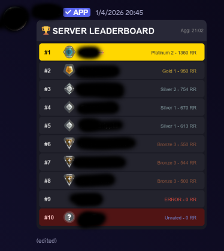

# Smurf Valorant Manager & Tracker 🔫


A ruthless, automated Discord assistant for **competitive Valorant players managing multiple accounts (Smurfs)**. This bot tracks MMR/Elo changes in real-time for all your alts, generates high-quality visual rank cards, manages server leaderboards, and **intercepts Riot Games 2FA codes directly from your Gmail**, forwarding them to a private Discord channel.

Designed to be hosted on cloud platforms (Render, Railway, Replit) or local servers, featuring a built-in **Watchdog** for self-healing and a Flask server for uptime monitoring.

## ✨ Key Features

* **📈 Multi-Account Rank Tracking:** Automatically fetches MMR, ELO, and Rank info via [HenrikDev API](https://github.com/Henrik-3/unofficial-valorant-api) for all your smurfs simultaneously.
* **🎨 Dynamic Visual Cards:** Generates high-quality PNG cards with your current rank, agent, and stats using `Pillow` and `Pilmoji` (supports Emojis!).
* **🏆 Live Leaderboard:** Auto-updates a server-wide leaderboard image sorting all your accounts by `Rank > Tier > RR`.
* **🔐 2FA Code Interceptor:** Connects to a dedicated Gmail account via IMAP, filters for *specific* Riot Games authentication emails, and forwards the code to Discord instantly. **Perfect for fast account switching.**
* **🐕 Watchdog System:** A background supervisor checks if the update loop or email fetcher hangs and restarts them automatically without killing the bot process.
* **☁️ Cloud Ready:** Includes a `main.py` with a Flask server to keep the bot alive on platforms that require an HTTP port binding.

## 📸 Screenshots

| Rank Card | Server Leaderboard |
| :---: | :---: |
|  |  |
| *Auto-generated dynamic cards* | *Live updating leaderboard* |

> **Setup Instructions for Images:**
> 1. Create a folder named `assets` in your repository.
> 2. Upload your screenshot named `card_preview.png` inside it.
> 3. Upload your screenshot named `leaderboard_preview.png` inside it.

## 🛠️ Prerequisites

Before installing, ensure you have the following credentials ready. **Without these, the bot will not work.**

1.  **Discord Bot Token:**
    * Create an app at [Discord Developer Portal](https://discord.com/developers/applications).
    * **Crucial:** Enable `MESSAGE CONTENT INTENT` under the "Bot" tab.
2.  **HenrikDev API Key:**
    * Get a key from the [HenrikDev Dashboard](https://docs.henrikdev.xyz/valorant.html). The bot supports key rotation if you have multiple keys.
3.  **Gmail App Password (For 2FA Feature):**
    * You **cannot** use your standard Gmail password.
    * Go to Google Account > Security > 2-Step Verification > [App Passwords](https://support.google.com/accounts/answer/185833).
    * Generate a 16-character password for this bot.

## 🚀 Installation

1.  **Clone the repository:**
    ```bash
    git clone [https://github.com/fulmiiiiine/Smurf-Valorant-Manager.git](https://github.com/fulmiiiiine/Smurf-Valorant-Manager.git)
    cd Smurf-Valorant-Manager
    ```

2.  **Install dependencies:**
    ```bash
    pip install -r requirements.txt
    ```

    > *Note for Linux/Docker users:* Ensure `fonts-liberation` or equivalent Arial fonts are installed. If the bot cannot find `arial.ttf`, card generation may look generic.

## ⚙️ Configuration

1.  Rename `config.json` (or `config.example.json`) to `config.json`.
2.  Edit `config.json` and fill in your details. **Do not commit this file to GitHub.**

```json
{
    "discord_token": "YOUR_DISCORD_BOT_TOKEN",
    "admin_user_id": 123456789,
    "channels": {
        "main_channel_id": 111222333,       
        "leaderboard_channel_id": 444555666, 
        "error_log_channel_id": 777888999,   
        "codes_channel_id": 0                
    },
    "guilds": {
        "auth_guild_id": 123456789 
    },
    "api": {
        "keys": ["HENRIK_KEY_1", "HENRIK_KEY_2"],
        "region": "eu"
    },
    "email": {
        "address": "bot_email@gmail.com",
        "password": "xxxx xxxx xxxx xxxx", 
        "imap_server": "imap.gmail.com",
        "imap_port": 993,
        "check_interval": 10
    },
    "users": [
        {
            "puuid": "PLAYER_PUUID",
            "name": "SmurfAccount#TAG",
            "login": "riot_username",
            "password": "riot_password"
        }
    ]
}
```

### ⚠️ Critical Note on Persistence

In `config.json`, the field `hardcoded_slot_ids` is used to persist messages across restarts.
1.  **First Run:** Leave them as `0`. The bot will send new messages for each tracked user.
2.  **After First Run:** Copy the **Message IDs** of the generated cards from Discord.
3.  **Update Config:** Paste these IDs into `hardcoded_slot_ids` in your `config.json`. This prevents the bot from spamming new messages every time it restarts.

## 🖥️ Usage

### Local / VPS
Run the bot script directly:
```bash
python ds.py
```

### Cloud (Render, Replit, Railway)
Run the entry point script which starts both the Flask server and the Discord bot thread:
```bash
python main.py
```

## 🎮 Slash Commands

| Command | Description | Permission |
| :--- | :--- | :--- |
| `/status` | Displays system health, uptime, next update countdown, and module status. | Admin |
| `/forceupdate` | Triggers an immediate API fetch for all users and updates the leaderboard. | Admin |
| `/fastcodice` | Forces an immediate IMAP check for Riot codes (last 24h scan). | Admin |
| `/forcewatchdog` | Manually triggers the system integrity check to verify loops are running. | Admin |
| `/restart` | Restarts the background tasks (Update/Email loops) without killing the process. | Admin |
| `/sync` | Manually syncs slash commands globally. | Admin |

## 🛡️ Disclaimer

This project is not affiliated with Riot Games or Discord. Usage of automated bots to interact with accounts may violate Terms of Service. Use at your own risk.

**Security Warning:** This bot handles sensitive data (API keys, Email credentials). **Ensure `config.json` is added to your `.gitignore` and never shared publicly.**

## ⚖️ License & Credits

This project is open-source for educational purposes.

* **Attribution Required:** If you use, fork, or modify this code for your own projects, videos, or repositories, you **MUST** provide clear credit and a link back to this repository.
* **No Plagiarism:** Claiming this code as your own without proper attribution is strictly prohibited.
* **Support:** If this project helped you, consider starring the repository ⭐.
